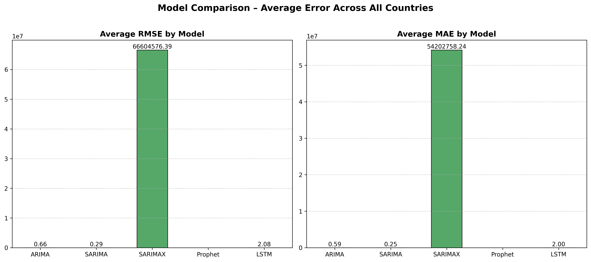
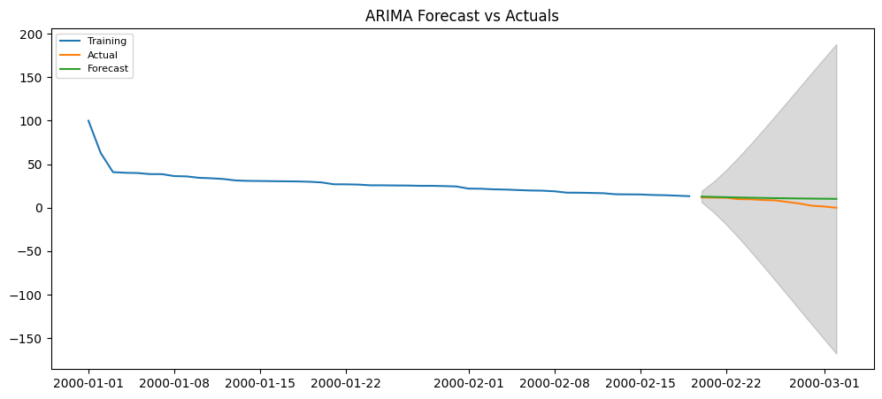
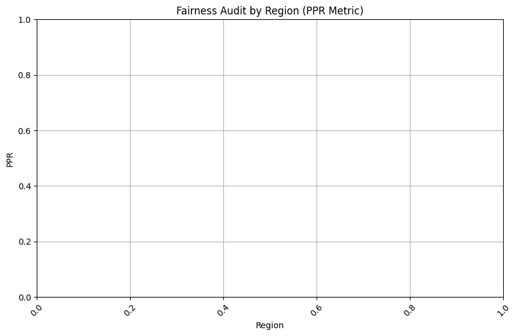

# Responsible AI Forecasting Framework for E-Governance


End-to-end **Responsible AI pipeline** for forecasting AI readiness indicators using the **AI Global Index dataset**.
The project integrates **time-series forecasting models, model evaluation, fairness auditing, and a deployed Streamlit dashboard**.

---

## Dataset

This project uses the **AI Global Index dataset**, which measures how prepared countries are to develop and adopt artificial intelligence.

Dataset Source
https://www.kaggle.com/datasets/katerynameleshenko/ai-index

The dataset includes:

* AI readiness index score
* Country-level indicators
* Regional grouping
* Multiple AI capability factors

---

## Pipeline Architecture

Dataset
↓
Data Preprocessing
↓
Exploratory Data Analysis (EDA)
↓
Forecasting Models

• ARIMA
• SARIMA
• SARIMAX
• Prophet
• LSTM

↓
Model Comparison (RMSE Evaluation)
↓
Best Model Selection
↓
Fairness Audit (AEQUITAS)
↓
Responsible AI Evaluation
↓
Streamlit Deployment Dashboard

---

## Project Structure

```
app/
└── app.py                    # Streamlit dashboard

checkpoint/
└── lstm_checkpoint.h5

code/
├── 01_data_preprocessing.py
├── 02_EDA.py
├── 03_models_training.py
├── 04_model_comparison.py
├── 05_fairness_audit.py
└── 06_final_model_save.py

data/
└── AI_index_db.csv

model/
└── lstm_model.h5

results/
├── rmse_comparison.png
├── forecast_plot.png
└── fairness_audit.png

requirements.txt
README.md
```

---

## Quickstart

Install dependencies

```
pip install -r requirements.txt
```

Place dataset

```
cp /path/to/AI_index_db.csv data/
```

Run the pipeline

```
python code/01_data_preprocessing.py
python code/02_EDA.py
python code/03_models_training.py
python code/04_model_comparison.py
python code/05_fairness_audit.py
python code/06_final_model_save.py
```

Launch Streamlit dashboard

```
streamlit run app/app.py
```

---

## Models Compared

| Model   | Library                | Type                     |
| ------- | ---------------------- | ------------------------ |
| ARIMA   | statsmodels / pmdarima | Statistical              |
| SARIMA  | pmdarima               | Seasonal                 |
| SARIMAX | statsmodels            | With exogenous variables |
| Prophet | Meta Prophet           | Decomposition            |
| LSTM    | TensorFlow / Keras     | Deep Learning            |

---

## Responsible AI Evaluation

Fairness analysis is performed using **AEQUITAS** to evaluate disparities in model performance across global regions.

Regions evaluated:

* Americas
* Europe
* Asia
* Africa
* Oceania

---

## Results

### RMSE Model Comparison



### Forecast Visualization



### Fairness Audit



---

## Technologies Used

Python • Pandas • NumPy • Scikit-learn • TensorFlow/Keras • Statsmodels
Prophet • AEQUITAS • Streamlit • AutoViz

---

## Notes

* Dataset contains **one row per country**
* Synthetic quarterly time series generated **2015-Q1 → 2024-Q4**
* LSTM weights saved automatically using **Keras ModelCheckpoint**

